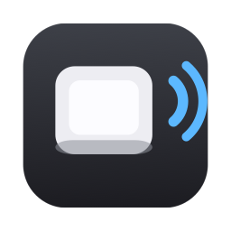
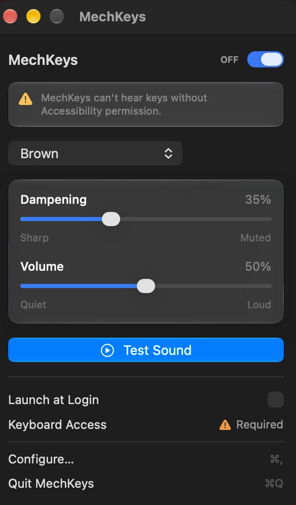
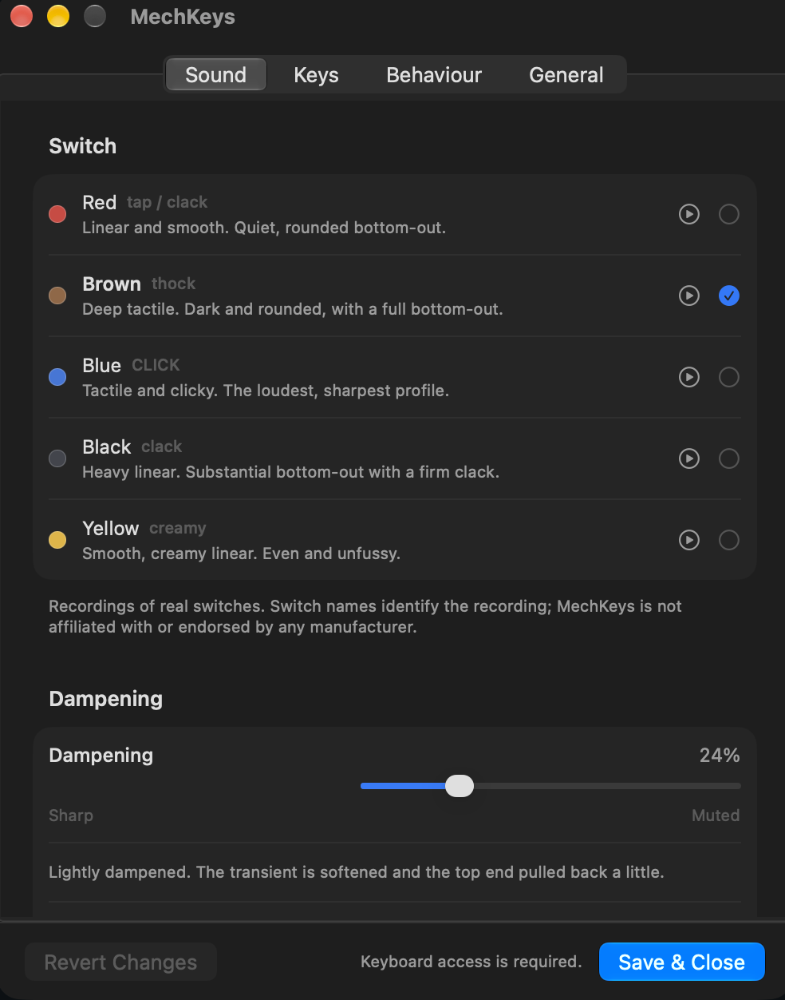
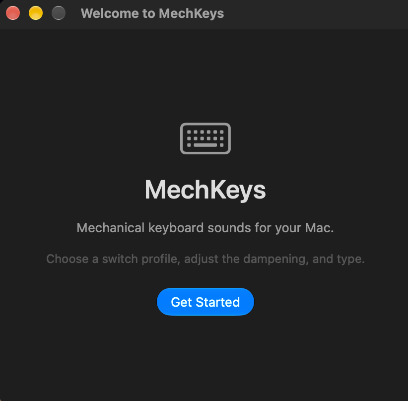

<div align="center">



# MechKeys

**Mechanical keyboard sounds for macOS.**

Choose what switch your Mac sounds like, then decide how acoustically dampened
it feels. It lives in the menu bar, and it never records what you type.



</div>

---

## What it does

MechKeys plays a short mechanical keypress sound for every key you press,
anywhere in macOS — Safari, Terminal, VS Code, Slack, Notes, a Spotlight query.

**Five switch profiles**, each with its own transient, body and ring:

| Profile | Character | Recorded from | |
|---|---|---|---|
| **Red** | `tap / clack` | Gateron Ink Red | Linear and smooth. Quiet, rounded bottom-out. |
| **Brown** | `thock` | Drop Holy Panda | Deep tactile. Dark and rounded, with a full bottom-out. |
| **Blue** | `CLICK` | Kailh Box Navy | Tactile and clicky. The loudest and sharpest of the five. |
| **Black** | `clack` | Gateron Ink Black | Heavy linear. Substantial bottom-out with a firm clack. |
| **Yellow** | `creamy` | NovelKeys Cream | Smooth, creamy linear. Even and unfussy. |

These are **recordings of real switches**, not synthesised approximations.
Switch names identify the recording; MechKeys is not affiliated with or
endorsed by any manufacturer.

### The dampening control is the point

This is the part that is not just a preset picker. The slider models packing a
keyboard with foam, silicone and plate gaskets — and it is neither a delay nor
a volume control.

```
Dampening

Sharp ─────────────●──────────── Muted
                   42%
```

| Position | What you hear |
|---|---|
| **0%** | Undampened. Full high-frequency energy, sharp transient, a long ring. |
| **25%** | Lightly dampened. Softened transient, top end pulled back a little. |
| **50%** | Noticeably smoother. Reduced sharpness and resonance, fuller and rounder. |
| **75%** | Strongly softened. Highs substantially reduced, very little ring left. |
| **100%** | Heavily dampened. Soft attack, filtered highs, minimal ringing — a muffled thud. |

Underneath, one slider position drives six DSP parameters at once: a low-pass
that sweeps logarithmically from 19 kHz down to 1.25 kHz, a high shelf, a
parametric cut aimed at *that profile's own* ring, a low-mid shelf that puts
body back, gentle compression, and transient softening applied to the sample
itself. All six are exposed under **Advanced** if you want to set them by hand.

Measured on the shipping signal chain, end to end: the proportion of energy
above 3 kHz falls from 0.56 to 0.0007 — nearly **three orders of magnitude** —
monotonically, while the level only drops to about half, and the sound still
starts in the very first sample. Those three properties are asserted by tests
on every run, because "not a volume control" and "not a delay" are claims that
are easy to make and easy to quietly break.

### Different keys, different sounds

The spacebar is pitched down and rattles like a stabilised key. Return is
heavier, Delete and Tab sit in between. Shift, Control, Option, Command, Caps
Lock and fn sound too, a little deeper than a letter — they fire constantly
while you type, so if that wears thin there is a switch for them in
Configure → Keys.

**Every key on the keyboard makes a sound**, including the top row. The
brightness, media and volume keys — F1, F2 and F7 to F12 on an Apple
keyboard — take some finding, because macOS does not report them as key
presses at all; they draw from the ordinary pool, like the rest of the top row.

Each category has its own level and pitch trim, and can be switched off
entirely.

### It does not sound like a loop

Five separate recordings of an ordinary key, never the same one twice in a row,
with up to ±2 dB of level and ±18 cents of pitch on each press. Turn variation
to zero and it means it: the same sample, every time.

<div align="center">

</div>

## Requirements

- macOS 26 or later
- Apple silicon

MechKeys is a menu bar application. It has no Dock icon.

## Installing

One line. It checks this Mac can run MechKeys, verifies the download against
the checksum published beside it, and puts the app in Applications:

```sh
curl -fsSL https://theysap.com/install/mechkeys | bash
```

Nothing is blocked on first launch this way: macOS attaches its quarantine flag
to what a *browser* downloads, not to what `curl` fetches, so the app opens
straight away.

That script is [`Scripts/install.sh`](Scripts/install.sh) in this repository,
and theysap.com serves a copy of it as plain text, so you can read it before
piping it into a shell. `MECHKEYS_VERSION` pins a version, and
`MECHKEYS_NO_LAUNCH=1` skips the launch at the end.

### Or by hand

Download the `.dmg` from [Releases](../../releases), open it, and drag MechKeys
into Applications. Every release also publishes the same image under a fixed
name, so [`releases/latest/download/MechKeys.dmg`](../../releases/latest/download/MechKeys.dmg)
is always the newest build.

### Updating

MechKeys checks for a newer release a few seconds after launch and every six
hours after that, and tells you only when there is one. **Check for Updates…**
in the menu bar asks on demand, and the version you are running is at the
bottom of the popover — it is the release tag, so it lines up with
[Releases](../../releases).

Pressing **Download & Restart** downloads the disk image, checks it against the
`SHA256SUMS.txt` published with the release, refuses it if they disagree, puts
it in place of the running copy and restarts. Your settings and your
Accessibility permission both survive: every release is signed with the same
identity, which is what macOS keys that permission to.

Turn the automatic check off in **Configure → General** if you would rather it
never reached the network on its own.

### That first launch is blocked. Here is how to get past it

A `.dmg` downloaded in a browser carries the quarantine flag, so macOS will
refuse to open what is inside it, with *"Apple could not verify 'MechKeys' is
free of malware that may harm your Mac or compromise your privacy."* The only
buttons are **Done** and **Move to Bin**.

That wording is alarming and the dialog offers no way forward, so to be plain
about what it means: macOS is not reporting that it found anything. It is
reporting that it cannot tell who built the app. MechKeys is **signed, but not
notarised**, because notarising requires a paid Apple Developer ID. The
signature is self-issued, so `spctl -a` returns `rejected` and Gatekeeper
refuses, exactly as designed. The Control-click → Open shortcut that used to
bypass this was removed in macOS 15.

The signature is not pointless, though: it is the *same* signature in every
release, which is what lets an update keep your Accessibility permission
instead of quietly taking it away.

**To open it, once:**

1. Double-click MechKeys, and click **Done** on the warning.
2. Open **System Settings → Privacy & Security** and scroll down to Security.
   It now says *"MechKeys was blocked to protect your Mac."*
3. Click **Open Anyway**, authenticate, and confirm.

Or, if you would rather do it in one line — this is exactly what the steps above
amount to, removing the quarantine flag macOS attached to the download:

```sh
xattr -dr com.apple.quarantine /Applications/MechKeys.app
```

**This is a first-launch problem only**, and it does not arise at all if you
install with the `curl` line above.

### Making it stop happening

Only one thing removes that dialog, and it is **notarisation** — which needs a
paid Apple Developer Program membership. Signing alone does not do it:

| | First launch of a downloaded copy | Permission after an update |
|---|---|---|
| Ad-hoc signed | Refused: *"Apple could not verify…"*, with only Done and Move to Bin | Lost, every time |
| Self-signed — **what is published today** | Refused the same way. A signature on its own has not been enough since macOS 10.15 | Survives |
| Developer ID signed **and notarised** | *"…is an app downloaded from the Internet. Are you sure you want to open it?"* → **Open** | Survives |

The build and the release workflow already do the whole of it — signing,
notarising, stapling, and importing the certificate on a clean CI runner —
given the right repository secrets.
[TECHNICAL.md](TECHNICAL.md#91-distribution-and-the-gatekeeper-wall) has the
exact steps.

Then open the popover from the menu bar icon and turn on **Launch at Login**.

## Permissions

MechKeys asks for exactly one permission, and it is unavoidable.

| Permission | Asked when | What it is for | Without it |
|---|---|---|---|
| **Accessibility** | First launch | Creating the listen-only event tap that reports *that* a key was pressed | No sounds at all. Everything else — profiles, Test Sound, settings — still works |
| **Login item** | You turn on *Launch at Login* | Starts the app when you log in, through `SMAppService` | Start it yourself |

macOS gates `CGEvent.tapCreate` behind Accessibility, and there is no other
supported way for a process to learn that a key was pressed in another
application. There is no narrower permission to ask for.

**What MechKeys does with it:**

- The tap is created **listen-only**. macOS will not let a listen-only tap
  modify, block or inject keystrokes even if it tried to.
- Inside the callback the keycode becomes one of six categories — standard,
  space, enter, backspace, tab, modifier — and then goes out of scope.
- The value handed to the audio system is that six-case enum. `KeyEvent` has
  three fields, and there is nowhere in it to put a character. Nothing
  downstream *can* log one.
- Switching MechKeys off does not mute it. The event tap is torn down.

In particular:

- **No microphone.** MechKeys plays audio; it does not record any.
- **No Screen Recording, Camera, or Full Disk Access.** It reads its own
  bundle and writes one `UserDefaults` key.
- **One network request, and you can turn it off.** MechKeys asks GitHub for
  its own latest release tag, and downloads a new version only when you press
  Download & Restart. It sends nothing — no identifiers, no version report, no
  analytics, no crash reporting, no account. Switch off *Check for updates
  automatically* in Configure → General and it makes no requests at all unless
  you ask it to.
- **The App Sandbox is deliberately off**, because a sandboxed process is not
  permitted to create a `CGEventTap` at all. The hardened runtime is on.

Changed your mind? System Settings → Privacy & Security → **Accessibility** →
MechKeys.

## Settings

The popover carries the three things worth changing mid-task. **Configure…**
opens the rest.

| Tab | What is in it |
|---|---|
| **Sound** | Switch profile, dampening and its six advanced DSP parameters, master volume |
| **Keys** | Modifier sounds, and per-category enable / level / pitch for all six key categories |
| **Behaviour** | Key-repeat handling, minimum interval, variation amount, overlapping voices |
| **General** | Permission status, launch at login, version and updates, privacy summary, reset, quit |

Everything applies immediately. **Save & Close** confirms and dismisses the
window — MechKeys keeps running in the menu bar. **Revert Changes** undoes
everything since the window was opened, from a snapshot taken when it opened.
**Quit MechKeys** exits entirely.

<div align="center">

</div>

## How it works

A keypress has to become a sound fast enough that the two feel simultaneous, so
the work is arranged to happen everywhere except on the key path.

```
key down
   │
   ▼
CGEventTap (.listenOnly)          ← its own thread, its own run loop
   │  classify → KeyCategory, check two rate limits, return
   ▼
audio queue
   │  pick a pre-processed buffer, pick a free voice, schedule
   ▼
persistent AVAudioEngine graph
```

The event callback does no allocation, no file I/O and no audio work — it is
also the latency budget for the whole app, and macOS disables a tap that takes
too long to respond. The audio graph is built once at launch and stays alive;
there is no per-keypress player node and no per-keypress file read.

The dampening chain is split in two, by necessity. Transient softening and
ring-out reshape the one-shot itself, so they are pre-rendered offline into a
buffer cache whenever the relevant settings change. The filters, compression
and limiting live on a shared bus, so moving the slider is a handful of
parameter writes and takes effect on the very next keypress.

### Further in

[**TECHNICAL.md**](TECHNICAL.md) covers the whole of it: the event path and what
is deliberately not retained, the audio graph, the dampening curve and why each
parameter is eased the way it is, why the EQ sits after the compressor, where
the recordings come from, and how the audio claims in this README are measured
without a speaker.

## Building

Only the Command Line Tools are needed; Xcode is not.

```sh
swift build                 # build
./Scripts/test.sh           # run the tests
./Scripts/build-app.sh      # assemble dist/MechKeys.app
./Scripts/make-dmg.sh       # package dist/MechKeys-<version>.dmg
```

To sign with a real identity, set `DEVELOPER_ID_APPLICATION` before building:

```sh
export DEVELOPER_ID_APPLICATION="Developer ID Application: Your Name (TEAMID)"
./Scripts/build-app.sh
```

Without it the bundle is ad-hoc signed, which runs — but macOS keys the
Accessibility grant to the code signature, and an ad-hoc signature changes on
every build. Each rebuild is then a different app to macOS: the switch stays on
in System Settings pointing at a build that no longer exists, while the new one
is silently refused.

Run this once and the problem goes away, because the signing identity stops
changing:

```sh
./Scripts/make-dev-certificate.sh
```

If permission is already stuck, clear the stale grant and start again:

```sh
tccutil reset Accessibility com.mechkeys.app
```

`MechKeys --diagnose` prints the app's own view of its signature and whether it
can actually create an event tap. Run from a terminal it reports on *the
terminal's* Accessibility rather than the app's — macOS grants that permission
to the responsible process — so it says so and softens its verdict. The
trustworthy check is Keyboard Access in the popover.

### The sounds

All 120 bundled recordings are of real keyboards, by Thomas Lai (`tplai`),
published as part of kbsim under the MIT licence. They ship inside the app
bundle — there is no sound pack to download and nothing is ever fetched to make
a sound. The MIT
notice travels with them in the bundle, which is what the licence requires;
see [assets/LICENSES.md](assets/LICENSES.md) for the full provenance.

[`Tools/import_sounds.py`](Tools/import_sounds.py) reproduces the conversion
from the upstream packs: resample to 48 kHz, trim leading silence, short edge
fades, normalise. They are committed so a clone builds with no network and no
Python.

### Development

```sh
./Scripts/install-hooks.sh                                  # format, build and test before each commit
dist/MechKeys.app/Contents/MacOS/MechKeys --popover         # the popover, in an ordinary window
dist/MechKeys.app/Contents/MacOS/MechKeys --configure       # straight to the configuration window
dist/MechKeys.app/Contents/MacOS/MechKeys --onboarding      # the first-run flow again
```

Those flags exist because capturing a menu bar popover otherwise needs
screen-recording permission, which makes the UI awkward to inspect any other
way. The images in this README were taken with them.

Note that view-local state lives in `ViewState` rather than `@State`: `@State`
became a macro in the macOS 26 SDK and its plugin ships only with Xcode, not
with the Command Line Tools.

[QA.md](QA.md) has the manual checklist for what the tests cannot reach — real
keyboards, real audio devices, and behaviour over hours.

## Contributing

Commit subjects are the version the commit brings the project to — `v0.4.0`,
`v1.0.0` — with the explanation in the body. The `commit-msg` hook enforces it,
and `CHANGELOG.md` is kept up to date alongside.

## License

MIT. See [LICENSE](LICENSE).
